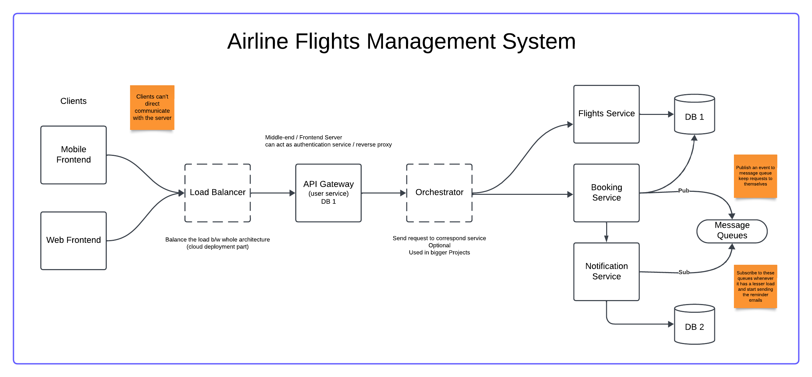

# Airline Flights Management System

Welcome to the Airline Flights Management System, a comprehensive solution built using Node.js and Express.js, following the MVC architecture. This system is designed to manage various aspects of an airline, and it consists of microservices that handle specific functionalities.



## Table of Contents

- [Microservices](#microservices)
  - [Flights Service](#flights-service)
  - [API-Gateway with User Service](#api-gateway-with-user-service)
  - [Flights Booking Service](#flights-booking-service)
  - [Notification Service](#notification-service)
- [Database](#database)
- [Getting Started](#getting-started)
- [Contributing](#contributing)
- [License](#license)

## Microservices

Each service is developed independently for better scalability and maintainability.

### Flights Service

The Flights Service microservice is responsible for managing flight-related information, such as schedules, availability, and pricing. It serves as a core component in the airline management system.

### API-Gateway with User Service

This microservice acts as an API Gateway, handling user-related functionalities and acting as a gateway to other services. This Service is responsible for managing user profiles, authentication, and authorization.

### Flights Booking Service

The Flights Booking Service is in charge of handling flight reservations and bookings. It interacts with the Flights Service to check availability and updates the user's booking status.

### Notification Service

The Notification Service is responsible for sending notifications to users. It utilizes RabbitMQ as a message broker to communicate with the Flights Booking Service and send email notifications to users regarding their bookings.

## Database

[Sequelize ORM](https://sequelize.org/) is employed for database management, using MySQL as the database system. Sequelize provides a robust and efficient way to interact with the database, ensuring data integrity and reliability.

## Getting Started

1. Clone the repository:

```Terminal
git clone https://github.com/KumaKode/Airline-Flights-Management-System --recursive
```

2. Install dependencies for each microservice:

```Terminal
cd flights-service
npm install

cd ../api-gateway
npm install

cd ../flights-booking-service
npm install

cd ../notification-service
npm install

```

3. Configure the database settings in each microservice's configuration file.

```
npx sequelize init --force
```

- The configuration file is located in the `config` folder. Create a preffered database name and add your database credentials.

4. Start each microservice by defining the environment variables:

```
cd flights-service
npm run dev

cd ../api-gateway
npm run dev

cd ../flights-booking-service
npm run dev

cd ../notification-service
npm run dev

```

5. For running the project in docker, you can do the following:

- Convert the config.json file in every service config folder to js file and add the following code:

```
require("dotenv").config();
const isDocker = require("./is-docker"); //Checking if running on docker!

// prettier-ignore
module.exports = {
  "development": {
    "username": isDocker() ? process.env.MYSQL_ROOT_USER : "root",
    "password": isDocker() ? process.env.MYSQL_ROOT_PASSWORD : "yourLocalPassword",
    "database": "yourDataBaseName",
    "host": isDocker() ? process.env.DB_HOST : "127.0.0.1",
    "dialect": "mysql"
},
"test": {
    "username": "root",
    "password": null,
    "database": "database_test",
    "host": "127.0.0.1",
    "dialect": "mysql"
},
"production": {
    "username": "root",
    "password": null,
    "database": "database_production",
    "host": "127.0.0.1",
    "dialect": "mysql"
}
};

```

6. In your services root directory, add the following environment variables in your .env file:

```
MYSQL_ROOT_USER = "root"
MYSQL_ROOT_PASSWORD = "mypassword"
DB_HOST = "airline-db" // Name of the database container
```

7. To run the project in docker:

```
docker compose up
```

## Contributing

Feel free to contribute to the project by opening issues or creating pull requests.

## License

This project is licensed under the MIT License.

Creds - @singhsanket143 Instructor
